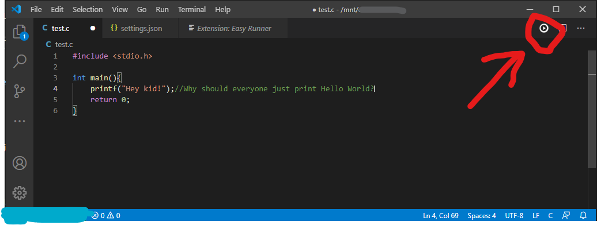

# Easy Run README

Stay simple, stay happy!

To run a code first write your code and then press the  button  
  
  

> ***Note: Hit save before running code and if the run icon does not appear, click inside the text editor and it should***

## Features

  

* Run all types of files using your custom command.

* And in just one click

  
  

## Extension Settings

  

This extension contributes the following settings:

  

### easyRun.fileTypes

  

Set the commands for different file extensions

This option accepts an object as
*  `file_extension_with_dot` : `command to run`

I.e:

    {
        `".js"` : `"node ./${fileDirWorkSpace}/${fileBaseName}"`
    }

  
 ##### Available variables are:
    
    *  `${filePath}` : Complete file path with drives (`C:\Users\You\js\main.js` in windows) and (`/home/you/js/main.js` in Unix)
    
    *  `${fileDir}` : File directory path with drives (`C:\Users\You\js` in windows) and (`/home/you/js` in Unix)
    
    *  `${fileBaseName}` : File name (`main.js` in this case)
    
    *  `${fileNameNoExt}` : File name without extension. Suppose you file path is `C:\Users\You\js\main.js`, then it will be compiled to `main`
    
    *  `${workSpacePath}` : Workspace path with drives I.e `C:\Users`
    
    *  `${fileDirWorkSpace}` : File directory path after workspace (If wokspace path is C:\Users then this will return `You\js`

  
  

### easyRun.clear

Wheather or not to clear the console before running every command

*  `easyRun.clear`: `true` or `false`

  
  

### easyRun.executeCommanInOneLine

Set how commands should be exectuted.

*  `easyRun.executeCommanInOneLine`: `true` or `false`

* If set `true` then compile and run command will be executed in one line as `gcc ./test.c -o ./test && ./test`

* If set to `false` then command string will broken using `&&`. `command1 && command2` will run as `commnd1` and then `command2`

-> ***This options is helpful for windows users because in some cases `&&` results to error.***

  
  

## Known Issues

  

There is no known issues yet.

If you find any then please consider texting me in [***Instagram***](https://instagram.com/alor_pretatma) or [***Twitter***](https://twitter.com/alor_pretatma)

  

## Release Notes

### 0.0.4

Probable bug fixed

### 0.0.3

Added option to set commands in multiline

  

### 0.0.2

Added directory recognition for files from outside of workspace

  

### 0.0.1

Initial release

  

-----------------------------------------------------------------------------------------------------------

  

### For more information

  

*  [Instagram](https://instagram.com/alor_pretatma)

*  [Twitter](https://twitter.com/alor_pretatma)

  

**Enjoy!**